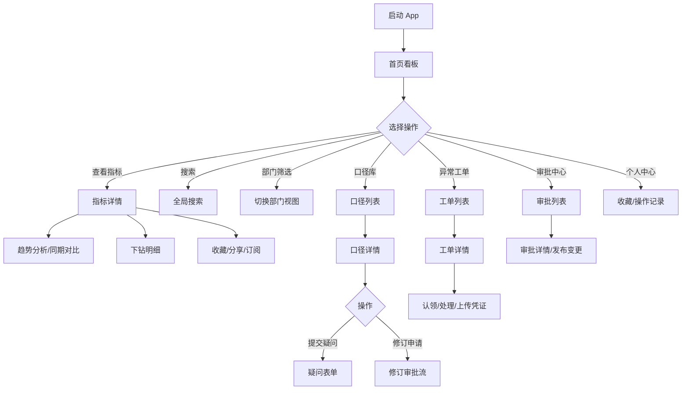

## 1. 产品概述

数据中台移动 App 是为业务负责人打造的一站式数据管理工具，支持随时查看关键业务指标、确认数据口径定义、处理数据异常工单。App 面向企业各层级业务管理者，提供移动端数据洞察与治理能力，帮助决策者快速响应数据问题、提升数据决策效率。

核心价值：打破数据查看与治理的时空限制，实现"数据在手，决策无忧"的敏捷数据管理体验。

## 2. 核心功能

### 2.1 用户角色

| 角色 | 说明 | 核心权限 |
|------|------|----------|
| 业务负责人 | 各部门业务线管理者 | 查看指标、确认口径、处理异常、审批变更 |
| 数据管理员 | 数据中台运营人员 | 维护口径、管理工单、发布变更 |
| 普通用户 | 业务分析人员 | 查看指标、提交疑问、收藏指标 |

### 2.2 功能模块

1. **首页看板**：关键指标概览、部门筛选、趋势图展示、同期对比、搜索入口
2. **指标详情**：指标多维展示、趋势分析、下钻明细、同期对比、分享链接
3. **口径库**：口径说明文档、搜索指标口径、提交口径疑问、发起修订申请
4. **异常工单**：异常告警列表、接收异常提醒、认领处理任务、填写处理结果、上传截图凭证
5. **订阅提醒**：指标订阅管理、阈值告警配置、推送通知记录
6. **审批中心**：变更申请审批、口径修订审批、发布变更、查看审批历史
7. **个人收藏**：常用指标收藏、收藏分类管理、快捷访问入口、操作记录

### 2.3 页面详情

| 页面名称 | 模块名称 | 功能描述 |
|-----------|-------------|---------------------|
| 首页看板 | KPI 指标卡 | 展示核心指标数值、环比/同比变化、趋势小图 |
| 首页看板 | 部门筛选器 | 按部门/业务线切换指标视图，支持多选 |
| 首页看板 | 时间选择器 | 切换日/周/月/季/年维度，自定义时间范围 |
| 首页看板 | 趋势图表 | 折线图/柱状图展示指标趋势，支持双指缩放 |
| 首页看板 | 搜索栏 | 全局搜索指标名称、口径、工单 |
| 指标详情 | 指标头卡 | 指标名称、当前值、负责部门、更新时间 |
| 指标详情 | 多维度趋势 | 支持多指标叠加对比、时间维度切换 |
| 指标详情 | 同期对比 | 同比/环比数据表，高亮差异项 |
| 指标详情 | 下钻明细 | 按地区/渠道/产品等维度下钻数据表 |
| 指标详情 | 操作栏 | 收藏、分享、订阅、查看口径快捷入口 |
| 口径库 | 口径列表 | 口径卡片列表，展示指标名、口径版本、状态 |
| 口径库 | 口径详情 | 完整口径定义、计算公式、数据来源、修订历史 |
| 口径库 | 提交疑问 | 表单提交口径疑问，附截图，关联责任人 |
| 口径库 | 修订申请 | 发起口径修订，填写变更原因、建议内容 |
| 异常工单 | 工单列表 | 待处理/处理中/已完成 Tab，展示异常级别 |
| 异常工单 | 工单详情 | 异常描述、指标快照、影响范围、时间线 |
| 异常工单 | 认领任务 | 一键认领工单，指派处理人 |
| 异常工单 | 处理表单 | 填写处理结果、根因分析、上传截图凭证 |
| 订阅提醒 | 订阅列表 | 已订阅指标、告警阈值、通知方式 |
| 订阅提醒 | 新增订阅 | 配置指标订阅规则、阈值、推送渠道 |
| 订阅提醒 | 通知记录 | 历史推送消息列表，支持标记已读 |
| 审批中心 | 待审批 | 待我审批的变更/修订申请，支持快捷审批 |
| 审批中心 | 已审批 | 我已审批的历史记录，展示审批意见 |
| 审批中心 | 审批详情 | 申请内容、变更对比、审批流时间线 |
| 审批中心 | 发布变更 | 审批通过后发布变更，生成版本记录 |
| 个人收藏 | 收藏列表 | 按分类展示收藏的指标，支持拖拽排序 |
| 个人收藏 | 分类管理 | 新建/编辑/删除收藏分类 |
| 个人收藏 | 操作记录 | 个人操作日志，筛选查看历史操作 |

## 3. 核心流程

### 3.1 指标查看与分析流程
用户打开 App → 首页看板浏览 KPI → 按部门筛选 → 切换时间维度 → 点击指标卡进入详情 → 查看趋势图与同期对比 → 下钻查看明细数据 → 收藏/分享/订阅指标

### 3.2 口径确认与修订流程
用户搜索口径 → 阅读口径说明 → 如有疑问提交疑问表单 → 如需修订发起修订申请 → 数据管理员审批 → 审批通过发布变更 → 通知相关订阅者

### 3.3 异常工单处理流程
系统检测数据异常 → 推送异常提醒 → 业务负责人查看工单 → 认领处理任务 → 分析异常原因 → 填写处理结果并上传凭证 → 工单完成归档

### 3.4 Mermaid 流程图

## 4. 用户界面设计

### 4.1 设计风格
- **主色调**：科技蓝 `#1E5EFF`（品牌色）+ 深空灰 `#1A1F36`（深色背景）
- **辅助色**：成功绿 `#00C48C`、警示橙 `#FFAB00`、危险红 `#FF4D4F`、信息紫 `#722ED1`
- **背景色**：深色模式主背景 `#0F1326`、卡片背景 `#1A1F36`、分割线 `#2A2F48`
- **按钮风格**：圆角 12px，渐变填充，微立体阴影，点击反馈动效
- **字体**：标题使用 `PingFang SC Semibold`，正文使用 `PingFang SC Regular`，数字使用 `DIN Alternate Bold`
- **布局风格**：卡片式布局 + 圆角模块 + 毛玻璃顶部栏 + 底部 Tab 导航
- **图标风格**：线性图标，2px 描边，圆角端点，品牌色填充激活态
- **整体调性**：科技感深色系，数据可视化突出，专业商务感

### 4.2 页面设计概览

| 页面名称 | 模块名称 | UI 元素 |
|-----------|-------------|-------------|
| 首页看板 | KPI 指标卡 | 渐变背景卡、数值动效、环比徽章、迷你趋势线 |
| 首页看板 | 趋势图表 | 渐变折线、区域填充、双轴对比、数据点悬浮提示 |
| 首页看板 | 筛选栏 | 横向滚动部门 Chip、激活态品牌色胶囊 |
| 指标详情 | 头卡区域 | 大号数值、趋势箭头、负责人头像组 |
| 指标详情 | 对比表格 |斑马纹、差异值色阶高亮、可展开行 |
| 口径库 | 口径卡片 | 版本徽章、状态标签、进度条完成度 |
| 异常工单 | 工单列表 | 级别色条（红/橙/黄）、状态徽章、认领按钮 |
| 异常工单 | 处理表单 | 分段控件、富文本输入、图片上传网格 |
| 审批中心 | 审批流 | 竖向时间线、节点图标、审批气泡 |
| 个人收藏 | 收藏网格 | 瀑布流布局、分类色标、拖拽把手 |

### 4.3 响应式设计
- **移动端优先**：以 375px（iPhone SE）为基准设计，向上兼容至 430px（iPhone 14 Pro Max）
- **自适应布局**：关键模块采用 Flex + Grid 自适应，平板端展示双列
- **触控优化**：可点击区域 ≥ 44×44pt，按钮间距 ≥ 8pt，支持左滑删除/快捷操作
- **安全区适配**：底部 Tab 适配 iPhone 刘海屏和底部安全区
- **横竖屏切换**：图表区域支持横屏全屏展示，表格自动切换为可滚动模式

### 4.4 动效与交互
- **页面转场**：右进左出滑入动效，时长 300ms，贝塞尔曲线 `ease-out`
- **数字滚动**：KPI 数值加载时 count-up 动效，千分位格式化
- **图表动画**：折线图路径绘制动画，柱状图逐根升起，时长 800ms
- **下拉刷新**：品牌色旋转 Loading + 弹性回弹
- **上滑加载**：底部渐隐 Loading 指示器
- **微交互**：按钮点击缩放 0.96、卡片悬停（移动端长按）轻微浮起
