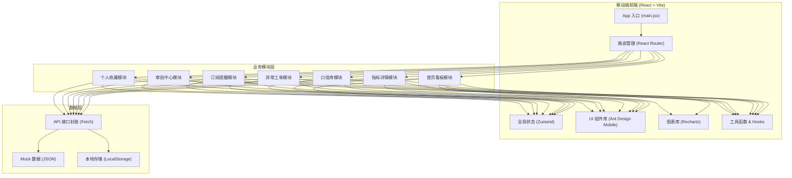
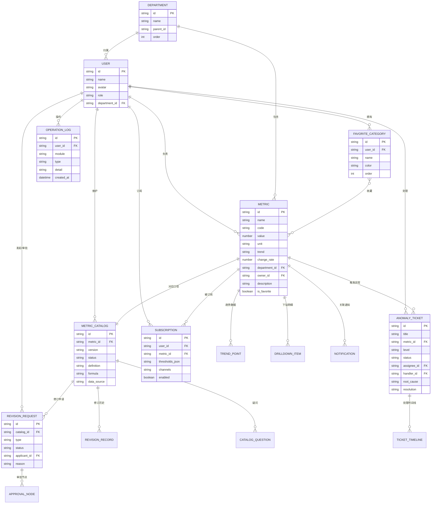

## 1. 架构设计



## 2. 技术描述

- **前端框架**：React@18 + React Router@6 路由管理
- **构建工具**：Vite@5（极速开发启动、HMR 热更新）
- **样式方案**：Tailwind CSS@3 + CSS Modules + CSS 变量主题
- **UI 组件**：Ant Design Mobile@5（移动端专属组件库）
- **数据可视化**：Recharts@2（React 图表库，支持折线/柱状/饼图等）
- **状态管理**：Zustand@4（轻量级全局状态，替代 Redux）
- **图标方案**：@ant-design/icons + 自定义 SVG 图标
- **Mock 数据**：本地 JSON 文件 + MSW（可选 Mock Service Worker）
- **工具链**：ESLint + Prettier + PostCSS + Autoprefixer
- **数据持久化**：LocalStorage 存储用户偏好、收藏列表、浏览记录

## 3. 路由定义

| 路由路径 | 页面名称 | 模块说明 |
|----------|----------|----------|
| `/` | 重定向到首页 | 入口重定向 |
| `/dashboard` | 首页看板 | KPI 概览、部门筛选、趋势图 |
| `/metric/:id` | 指标详情 | 指标多维分析、下钻、对比 |
| `/metrics` | 指标列表 | 全部指标搜索、筛选 |
| `/catalog` | 口径库 | 口径列表、搜索 |
| `/catalog/:id` | 口径详情 | 口径说明、修订、疑问 |
| `/tickets` | 异常工单 | 工单列表、状态 Tab |
| `/tickets/:id` | 工单详情 | 工单处理、上传凭证 |
| `/tickets/:id/handle` | 工单处理 | 处理表单页 |
| `/subscriptions` | 订阅提醒 | 订阅列表、通知记录 |
| `/subscriptions/new` | 新建订阅 | 订阅规则配置 |
| `/approvals` | 审批中心 | 待审批/已审批列表 |
| `/approvals/:id` | 审批详情 | 审批流、审批操作 |
| `/favorites` | 个人收藏 | 收藏列表、分类 |
| `/favorites/records` | 操作记录 | 历史操作日志 |
| `/search` | 全局搜索 | 跨模块搜索结果 |

## 4. 数据模型定义

### 4.1 核心 TypeScript 类型定义

```typescript
// 指标类型
interface Metric {
  id: string;
  name: string;
  code: string;
  value: number;
  unit: string;
  trend: 'up' | 'down' | 'flat';
  changeRate: number;
  changeType: 'mom' | 'yoy';
  departmentId: string;
  departmentName: string;
  owner: User;
  updatedAt: string;
  description: string;
  isFavorite: boolean;
  miniChart: number[];
  categories: string[];
}

// 趋势数据点
interface TrendPoint {
  date: string;
  value: number;
  compareValue?: number;
}

// 下钻明细
interface DrillDownItem {
  dimension: string;
  name: string;
  value: number;
  percentage: number;
  changeRate: number;
}

// 口径定义
interface MetricCatalog {
  id: string;
  metricId: string;
  metricName: string;
  version: string;
  status: 'draft' | 'published' | 'deprecated';
  definition: string;
  formula: string;
  dataSource: string;
  updateFrequency: string;
  dimensions: string[];
  owner: User;
  reviewers: User[];
  history: RevisionRecord[];
  createdAt: string;
  updatedAt: string;
}

// 修订记录
interface RevisionRecord {
  id: string;
  version: string;
  changeType: 'create' | 'update' | 'deprecate';
  changeContent: string;
  operator: User;
  approvedBy?: User;
  operatedAt: string;
}

// 口径疑问
interface CatalogQuestion {
  id: string;
  catalogId: string;
  question: string;
  screenshots: string[];
  asker: User;
  answer?: string;
  answerer?: User;
  status: 'pending' | 'answered' | 'closed';
  createdAt: string;
}

// 修订申请
interface RevisionRequest {
  id: string;
  catalogId: string;
  type: 'create' | 'update' | 'deprecate';
  reason: string;
  suggestedContent: string;
  applicant: User;
  status: 'pending' | 'approved' | 'rejected' | 'published';
  approvals: ApprovalNode[];
  createdAt: string;
}

// 异常工单
interface AnomalyTicket {
  id: string;
  title: string;
  metricId: string;
  metricName: string;
  level: 'critical' | 'high' | 'medium' | 'low';
  description: string;
  snapshotValue: number;
  expectedValue: number;
  deviation: number;
  departmentId: string;
  assignee?: User;
  handler?: User;
  status: 'pending' | 'processing' | 'completed';
  rootCause?: string;
  resolution?: string;
  evidences: string[];
  timestamps: TicketTimeline[];
  createdAt: string;
  detectedAt: string;
}

// 工单时间线
interface TicketTimeline {
  action: string;
  operator: User;
  remark?: string;
  timestamp: string;
}

// 订阅规则
interface Subscription {
  id: string;
  metricId: string;
  metricName: string;
  thresholds: Threshold[];
  notifyChannels: ('app' | 'email' | 'sms' | 'wechat')[];
  enabled: boolean;
  createdAt: string;
}

// 告警阈值
interface Threshold {
  type: 'above' | 'below' | 'change_rate';
  value: number;
  level: 'warning' | 'critical';
}

// 通知记录
interface Notification {
  id: string;
  type: 'anomaly' | 'threshold' | 'approval' | 'revision';
  title: string;
  content: string;
  relatedId?: string;
  isRead: boolean;
  createdAt: string;
}

// 审批节点
interface ApprovalNode {
  id: string;
  order: number;
  approver: User;
  status: 'pending' | 'approved' | 'rejected' | 'skipped';
  opinion?: string;
  operatedAt?: string;
}

// 收藏分类
interface FavoriteCategory {
  id: string;
  name: string;
  color: string;
  metricIds: string[];
  order: number;
}

// 操作记录
interface OperationLog {
  id: string;
  type: string;
  module: string;
  targetName: string;
  detail: string;
  operator: User;
  createdAt: string;
}

// 用户
interface User {
  id: string;
  name: string;
  avatar: string;
  role: 'admin' | 'manager' | 'analyst';
  department: string;
}

// 部门
interface Department {
  id: string;
  name: string;
  parentId?: string;
  order: number;
}
```

## 5. 数据模型 ER 图



## 6. 全局状态管理设计

Zustand Store 切片划分：

```typescript
// stores/userStore.ts - 用户信息 & 权限
// stores/metricStore.ts - 指标数据 & 筛选条件
// stores/ticketStore.ts - 异常工单状态
// stores/catalogStore.ts - 口径库数据
// stores/subscriptionStore.ts - 订阅 & 通知
// stores/approvalStore.ts - 审批流状态
// stores/favoriteStore.ts - 收藏 & 操作记录
// stores/uiStore.ts - UI 交互状态（Loading、Toast、Modal）
```

## 7. 性能优化策略

- **图表懒加载**：Recharts 组件使用 React.lazy + Suspense
- **虚拟滚动**：长列表（工单/口径/操作记录）使用 react-window
- **数据缓存**：SWR (stale-while-revalidate) 策略缓存接口请求
- **图片优化**：上传凭证压缩 + WebP 格式 + 懒加载
- **按需加载**：React Router v6 路由级代码分割
- **内存优化**：Zustand selectors 避免不必要重渲染
